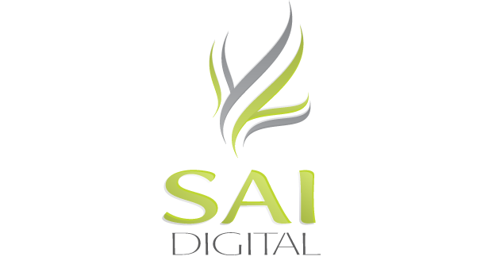

---

Who Are We?
===========

We are a small digital marketing, web design, and web development firm located in Rome.

SAI Digital began as The Steele Agency and was founded just over 3 years ago.

Our team is currently comprised of two developers, two designers, an office manager and our CEO.

---

What Do We Do?
==============

Central to our work is web development, where we mainly:

-  Develop new web applications for clients.
-  Modify existing web applications to meet client needs.
-  Maintain the platforms our applications are hosted on.
-  Integrate web apps with third party applications.

---

Our Backgrounds
===============

##Richard

##Sean

Graduated from Berry College with a degree in Computer Science in Spring 2009

Worked with a research firm based out of Atlanta doing data analysis, data management, and data mining for two years.

Began working for SAI Digital in August 2011.

