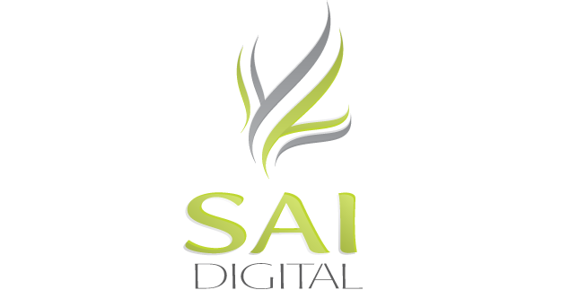

---

Who Are We?
===========

We are a small digital marketing, web design, and web development firm located in Rome.

SAI Digital began as The Steele Agency and was founded just over 3 years ago.

Our team is currently comprised of two developers, two designers, an office manager and our CEO.

---

What Do We Do?
==============

Central to our work is web development, where we mainly:

-  Develop new web applications for clients.
-  Modify existing web applications to meet client needs.
-  Maintain the platforms our applications are hosted on.
-  Integrate web apps with third party applications.

In addition to web development, we offer a suite of data-driven services including email marketing, social media strategies, digital advertising, and search engine optimization. Developers must build with an awareness of these tools and strategies.

We also have development projects based on new ideas or solutions created internally that are sold worldwide.

---

Our Backgrounds
===============

##Richard

Graduated from Berry College with a degree in Physics in Fall 2008.

Currently pursuing a degree in Electrical Engineering at Georgia Tech.

Began working for SAI Digital in 2009. Was the first full-time developer.

##Sean

Graduated from Berry College with a degree in Computer Science in Spring 2009

Worked with a research firm based out of Atlanta doing data analysis, data management, and data mining for two years.

Began working for SAI Digital in August 2011.

---
Development Platforms
=====================
For the exception of almost anything Microsoft, we are totally language and platform agnostic.

We use Wordpress on smaller projects.

-  It is extremely easy to get a website going quickly.
-  Especially good if the client wishes to control content.
-  Extra functionality can be added via PHP.

We use Ruby on Rails for larger projects, or if the client is asking for complex functionality.

-  Extremely fast development time. (We can get a simple site with logins going in about 20 minutes).
-  An "opinionated" framework. (Forces you to do certain things its way to keep your work organized)
-  Easy to use and logically organized.

We also work with Magento for clients that want online stores.

---

Development Platforms (Continued)
=================================

Apache is our web server of choice.

We use MySQL as our datastore for all of our web applications.

Sean uses CouchDB for some internal tools he uses.

We use Python for writing internal tools (web scrapers, data processing, etc.)

We have done non-web related work for clients

-  Data processing and document generation with Python.
-  Wrote an application that went on a CD and allowed the client to easily access various documents easily.

---

Development Environment
=======================

We develop and deploy from Linux.

We use Vim for editing almost everything.

We use Git and Subversion for version control.

-  **Everything** we do goes into version control.

We use Ruby Version Manager to keep a separate development environment for each Ruby on Rails application.

-  It allows you to have a different Ruby interpreter and libraries for each application.

---

Projects
========

A project lifecycle looks something like this:

-  Client makes request.
-  Meet with client. Gather requirements for application.
-  Give and release quote.
-  Agreement signing.
-  Build.
-  Deploy.

---

Projects - Client makes request
===============================

Our clients fill out a "ClientDiscovery" form which details what the client needs.

---

Projects - ClientDiscovery Example
=======================================

<iframe src="http://docs.google.com/viewer?url=http%3A%2F%2Fdl.dropbox.com%2Fu%2F1720529%2FClientDiscoveryForm-writable.pdf&embedded=true" width="825" height="575" style="border: none;"></iframe>

---

Projects - Meet with client
===========================

A meeting is scheduled with the client. We discuss the ClientDiscovery form and
"flesh out" the product from what the client needs.

---

Projects - Give and release quote
=================================

Based on the notes from the meeting and the ClientDiscovery form, a quote is given.

Usually, what the client asks for is similar to something we have done in the past, and we base our hourly estimates off of that.

---

Projects - An Example Quote
===========================

<iframe src="http://docs.google.com/viewer?url=http%3A%2F%2Fdl.dropbox.com%2Fu%2F1720529%2FAIBNAQuote.pdf&embedded=true" width="825" height="575" style="border: none;"></iframe>

---

Projects - Agreement Signing
============================

<iframe src="http://docs.google.com/viewer?url=http%3A%2F%2Fdl.dropbox.com%2Fu%2F1720529%2FWebAgreementTemplate.pdf&embedded=true" width="825" height="575" style="border: none;"></iframe>

---

Projects - Build
================

After the quote is released, the designers build mockups. The mockups are then approved by the client.

After a mockup is approved, the developers construct a template from the mockups.

Features requiring development work are implemented.

After most features are complete, the product is demoed for the client.

---

Projects - Deploy
=================

After a project is finished and the client is satisfied, the project is deployed.

We generally deploy the product on a RackSpace cloud host.

---

Want To Work For Us?
====================

---

Benefits
========

-  We're located in downtown Rome.
-  Young, enthusiastic team.
-  We have access to variety of development tools.
-  We use a variety of projects, languages, etc.
-  Unlimited snacks (seriously).
-  Bi-weekly Magic Finger Friday.
-  If full time, comprehensive health benefits.

---

Who Are We Looking For?
=======================

Obviously, write good code and adhere to modern web standards and security protocol, but in addition:

-  Comfortable in fast-paced, deadline-driven, team-based environment.
-  Competent writer and communicator to variety of audiences.
-  Work with artists and designers positively.
-  Self-motivated.
-  Up for any challenge.
